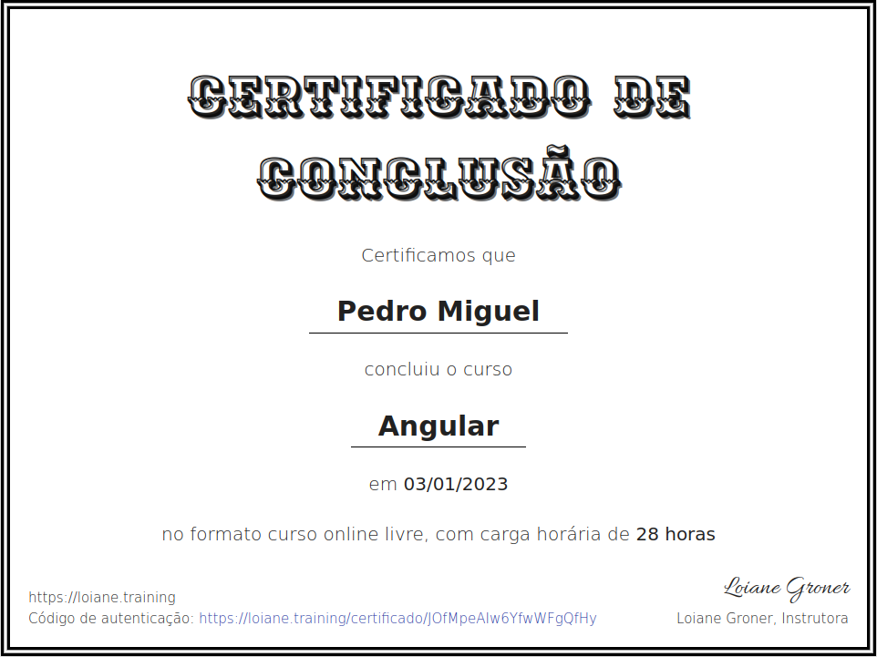

# angular-training

Curso angular da Loaine

Angular é um framework que permite desenvolver aplicações web e mobile, mantido pela Google. Apesar de ser a segunda versão do framework, Angular não é a continuação do Angular v1 (AngularJS) com melhores e novas funcionalidades, foi reescrito.

Nesse curso aprendemos como desenvolver com Angular e TypeScript, iniciando com os conceitos básicos e intermediários do Angular, desde os primeiros passos até uma aplicação completa com requisições ao servidor e rotas.

Aprendemos os conceitos de componentes, templates, diretivas, serviços, data-binding, validação de formulários, formulários reativos, roteamento (single page application – SPA) e como conectar ao servidor e trabalhar com RxJS (Observables).

Não é necessário saber AngularJS para esse curso, já que o Angular foi reescrito. Vamos aprender todos os conceitos do zero, então não se preocupe!

Nível: Iniciante ao Intermediário

LInk do meu certificado: https://loiane.training/certificado/JOfMpeAIw6YfwWFgQfHy

